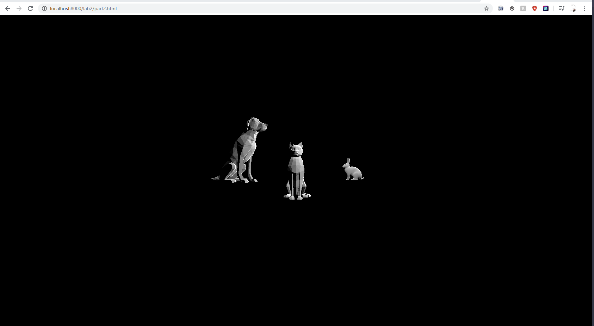
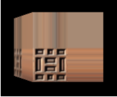

# CMPM163Labs
LAB2 PART1: https://drive.google.com/file/d/1WUGlvz_jQ7VJN8aNDgP-VuwTgmHYRWZn/view?usp=sharing

LAB2 PART2:

LAB3 FULL: https://drive.google.com/file/d/1yEMPowq-exT7Upv7oBxAS2yofuYAshoV/view?usp=sharing

How I created them:

LEFT (Wireframe): 
I created a basic mesh material in which I set a cyan color and turned on the wireframe mode. I inspected the source code 
from the THREE.JS WEB_GL MATERIALS example learn how to make this.

RIGHT (Two-Color-Interpolation): 
I interpolated between "aquamarine" and "perano" to make a smooth tealish gradient as shown within the video tutorial.

MIDDLE-BOTTOM (Phong): 
I created a phong material where its color is gray overall and I made its specular, the color when light shines on the 
material, green with a light-reflection intensity of 30 as shown within the video tutorial. Something I would like to create 
in the future is to make a material that has unique specular when hit with "UV" light.

MIDDLE-TOP (Rainbow): 
I duplicated fragment shader code and changed it by removing the mix function, which causes interpolation, and the two 
uniform colors. In gl_FragColor I just placed the whole position of the vUv variable like so... "gl_FragColor = vec4(vUv, 1.0)
;". I then proceeded to make a new variant of the addCoolCube function to link with the new
fragment shader code. I used the same vertex shader code when loading.

LAB4 Texture Cube Video: https://drive.google.com/file/d/18jCDACmrTjl-Z2Fjs_HoH4aYLyFruI80/view?usp=sharing

LAB4 Questions:
a. What is the formula given a u value of the uv coordinate (a value between 0 and 1), I get the x value of the pixel to 
sample from in this 8x8 texture?
The formula is x = (u * texture pixel size). The texture pixel size is 8 in this case.

b. What is the formula given a v value of the uv coordinate (a value between 0 and 1), I get the y value of the pixel to 
sample from in this 8x8 texture?
The formula is y = 8 - (v * texture pixel size). The texture pixel size is 8 in this case.

c. What color is sampled from the texture at the uv coordinate (0.375, 0.25)? (sample from the image based on the number your 
formula gives you i.e. (1, 0) is blue)
The sample color from the texture with uv coordinates (0.375, 0.25) is white.

LAB4 Cube Explanation:

BOTTOM-LEFT (Part 1 Texture A): 
I created a new phong material and applied the texture "161b.JPG" as stated in the tutorial. This only produced a flat 
texture when the pointlight hovers over it. 

BOTTOM-MIDDLE (Part 1 Texture A & Normal Map A): 
I created a new phong material and applied the texture "161b.JPG" and the normal "161_norm.JPG" as stated in the tutorial. 
This provided a crystal-like look.

BOTTOM-RIGHT (Part 1 Texture B & Normal Map B): 
I created a new phong material and applied the texture "156.JPG" and the normal "156_norm.JPG" as stated in the tutorial. 
This provided a grassy-like look. This was essentially duplicating the code from the previous texture & normal applied cube.

TOP-RIGHT (Part 2 Texture C): 
I copied my shader folder from lab 3 and reformmatted the code as stated within the tutorial and applied the "154.JPG" 
texture with the addTextureShaderCube1 function. Light cannot affect this cube because we have not modify that aspect to it.

TOP-MIDDLE (Part 2 Texture D): 
I made a new fragment shader and a vertex shader file. The new vertex shader is the same but I made a copy just in case that 
I wanted to modify it without changing the first vertex shader file. From my understanding and extensive amount research, I 
had to envision the cube as 4 different quadrants each with unique corner points. I found out that the vUv variable gives 
coordinate points that range from 0.0 to 1.0, which are the points used to correctly implement my chosen texture "176.JPG". 
However, that alone would only produce ONE tile on each face of my cube. To set up the 2x2 grid I had to multiply the vUv 
variable by 2.0 within the gl_FragColor function to stretch out the x and y axes. Thus, my texture would be placed within the 
bottom-left quadrant as shown within the tutorial. This means that the max range on each face of my cube would the vertices 
(0,0), (0,2) , (2,2), and (2,0) from my understanding. To implement the other 3 quadrants with missing tiles I would have to 
reference the coordinates within the bottom left quadrant. To do this, I created a for-loop which has if-conditions that checks 
whether vUv points exceed past the texture scaling coordinates. On a 2x2 grid our texture scale coordinates will be 0.5 which is 
my segmentedUV variable. I simply substract the vUv coordinates by that value in order to always reference the texture in the 
bottom-left quadrant. Overall, this part was challenging, but was really fulfilling when I found out how everything works.

Note: I made the point light rotate within a circular motion.

REFERENCE TO THE TEXTURE IN THE BOTTOM-LEFT QUADRANT FROM THE TUTORIAL:

 

