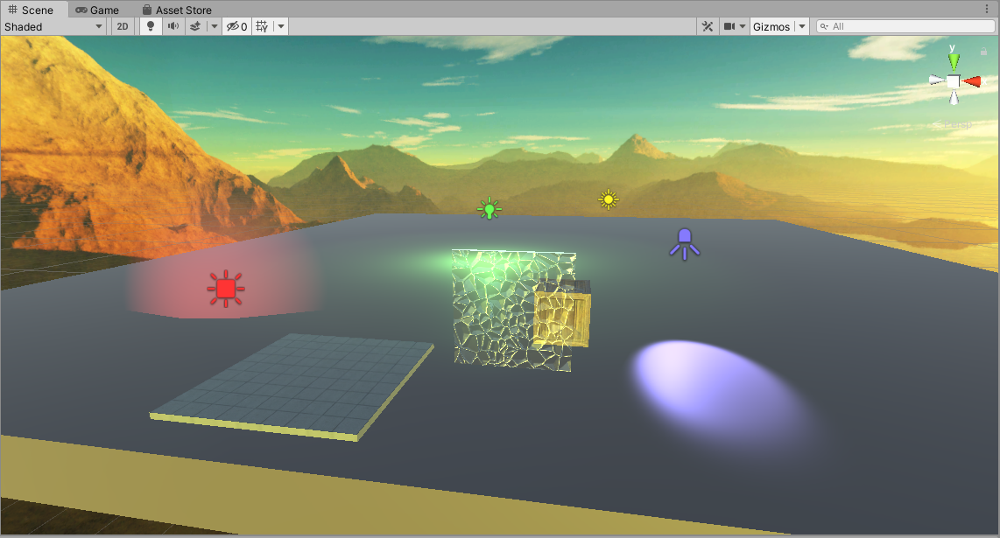
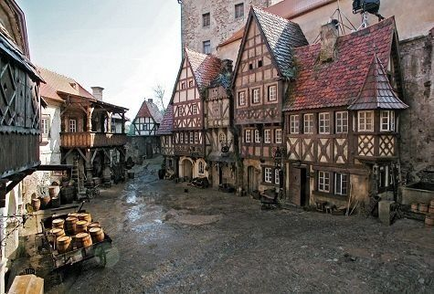

# CMPM163Labs
LAB2 PART1: https://drive.google.com/file/d/1WUGlvz_jQ7VJN8aNDgP-VuwTgmHYRWZn/view?usp=sharing

LAB2 PART2:

LAB3 FULL: https://drive.google.com/file/d/1yEMPowq-exT7Upv7oBxAS2yofuYAshoV/view?usp=sharing

How I created them:

LEFT (Wireframe): 
I created a basic mesh material in which I set a cyan color and turned on the wireframe mode. I inspected the source code 
from the THREE.JS WEB_GL MATERIALS example learn how to make this.

RIGHT (Two-Color-Interpolation): 
I interpolated between "aquamarine" and "perano" to make a smooth tealish gradient as shown within the video tutorial.

MIDDLE-BOTTOM (Phong): 
I created a phong material where its color is gray overall and I made its specular, the color when light shines on the 
material, green with a light-reflection intensity of 30 as shown within the video tutorial. Something I would like to create 
in the future is to make a material that has unique specular when hit with "UV" light.

MIDDLE-TOP (Rainbow): 
I duplicated fragment shader code and changed it by removing the mix function, which causes interpolation, and the two 
uniform colors. In gl_FragColor I just placed the whole position of the vUv variable like so... "gl_FragColor = vec4(vUv, 1.0)
;". I then proceeded to make a new variant of the addCoolCube function to link with the new
fragment shader code. I used the same vertex shader code when loading.

LAB4 Texture Cube Video: https://drive.google.com/file/d/18jCDACmrTjl-Z2Fjs_HoH4aYLyFruI80/view?usp=sharing

LAB4 Questions:
a. What is the formula given a u value of the uv coordinate (a value between 0 and 1), I get the x value of the pixel to 
sample from in this 8x8 texture?
The formula is x = (u * texture pixel size). The texture pixel size is 8 in this case.

b. What is the formula given a v value of the uv coordinate (a value between 0 and 1), I get the y value of the pixel to 
sample from in this 8x8 texture?
The formula is y = 8 - (v * texture pixel size). The texture pixel size is 8 in this case.

c. What color is sampled from the texture at the uv coordinate (0.375, 0.25)? (sample from the image based on the number your 
formula gives you i.e. (1, 0) is blue)
The sample color from the texture with uv coordinates (0.375, 0.25) is white.

LAB4 Cube Explanation:

BOTTOM-LEFT (Part 1 Texture A): 
I created a new phong material and applied the texture "161b.JPG" as stated in the tutorial. This only produced a flat 
texture when the pointlight hovers over it. 

BOTTOM-MIDDLE (Part 1 Texture A & Normal Map A): 
I created a new phong material and applied the texture "161b.JPG" and the normal "161_norm.JPG" as stated in the tutorial. 
This provided a crystal-like look.

BOTTOM-RIGHT (Part 1 Texture B & Normal Map B): 
I created a new phong material and applied the texture "156.JPG" and the normal "156_norm.JPG" as stated in the tutorial. 
This provided a grassy-like look. This was essentially duplicating the code from the previous texture & normal applied cube.

TOP-RIGHT (Part 2 Texture C): 
I copied my shader folder from lab 3 and reformmatted the code as stated within the tutorial and applied the "154.JPG" 
texture with the addTextureShaderCube1 function. Light cannot affect this cube because we have not modify that aspect to it.

TOP-MIDDLE (Part 2 Texture D): 
I made a new fragment shader and a vertex shader file. The new vertex shader is the same but I made a copy just in case that 
I wanted to modify it without changing the first vertex shader file. From my understanding and extensive amount research, I 
had to envision the cube as 4 different quadrants each with unique corner points. I found out that the vUv variable gives 
coordinate points that range from 0.0 to 1.0, which are the points used to correctly implement my chosen texture "176.JPG". 
However, that alone would only produce ONE tile on each face of my cube. To set up the 2x2 grid I had to multiply the vUv 
variable by 2.0 within the gl_FragColor function to stretch out the x and y axes. Thus, my texture would be placed within the 
bottom-left quadrant as shown within the tutorial. This means that the max range on each face of my cube would the vertices 
(0,0), (0,2) , (2,2), and (2,0) from my understanding. To implement the other 3 quadrants with missing tiles I would have to 
reference the coordinates within the bottom left quadrant. To do this, I created a for-loop which has if-conditions that checks 
whether vUv points exceed past the texture scaling coordinates. On a 2x2 grid our texture scale coordinates will be 0.5 which is 
my segmentedUV variable. I simply substract the vUv coordinates by that value in order to always reference the texture in the 
bottom-left quadrant. Overall, this part was challenging, but was really fulfilling when I found out how everything works.

Note: I made the point light rotate within a circular motion.

REFERENCE TO THE TEXTURE IN THE BOTTOM-LEFT QUADRANT FROM THE TUTORIAL:

 

I have chosen to do Part 1 of Lab 5 the Unity Kart Project

Lab 5 Video: https://drive.google.com/file/d/1qOQx1VPbyqdWEarxXpaIxctWHHCvQ9IX/view?usp=sharing

Modifications in which I changed:
1. I changed the particles' color and sizes by tuning values within the emission, collision, and shape settings.
2. I changed the skybox into a spacey background by clicking on the windows menu above and switching the skybox material.
3. I tweaked the racing kart's material into something more metallic through the inspector.
4. I switched the material color of the clouds to brown to make them seem like asteroids through the inspector.
5. I have my player interpolate between 10 different colors using a C# script I written up called "ColorLerper".

Lab 6
I did Part 1 the Unity portion of the lab.

Explanation by sections-

LIGHTS:

Point Light (Green)- This is a light source in which one can set it's position anywhere within 3D space. Changing its rotation is useless because the light illuminates in all directions equally. It behaves like a lightbulb.

Spot Light (Blue)- This is light source that illuminates within a conical shape. One could change the light source's orientation to have it point within various angles. Thus, the light's direction is affected by its local position and rotation. Overall, this light source is essentially a "spotlight" without the actual physical lamp attached above.

Directional Light (Yellow)- This light source behaves like the sun. It affects all objects within the scene through it's rotational property. Changing it's position has no effect within the scene as again the light affects everything within a global scale.

Area Light (Red)- Only works if there are lightmaps. It shines within a shape that is assigned to it. In this case, we are shining the light within a rectangular plane. Changing the planes width and height corresponds to the changes of its illumination.

MATERIAL OBJECT:

My example material is stained glass. I replicated this material in Unity by creating a standard shader material and changed its rendering property to transparent. I then adjusted material's alpha to "0" and increase it's smoothness to get that see-through look. I finally placed a glass stain normal map onto it to create the bumpiness as a finishing touch.

Reference:

Unity:

TEXTURE OBJECTS:
One texture object I made was a wooden crate in which I used a texture and normal map that I downloaded off a free asset website and applied both onto a 3D cube.
The other texture object I made was a tiled floor in which I made a 3D plane (a cube squished down) and had the texture tile repeat 3 by 3 times over the plane. I got the free texture online as well. 

Wood:

Stone Tile:

SKYBOX:
For the skybox, I downloaded a free asset from the unity store called "Cope! Free Skybox Pack" and applied the material within the renderer settings. I chose the mountain background from the pack because I thought it looked very beautiful. 

SCREENSHOT OF WHOLE SCENE:
Here is the scene shot with my material object, my two textured objects, my 4 different light sources color-coded, and my new skybox.

Lab 7
I worked on Part 1 the Unity Mesh Manipulation

Video Link to Scene: https://drive.google.com/file/d/1VgEdA_QPUz7cqgS31Um9T0lWxMd8YI9w/view?usp=sharing

Breakdown of how I made my scene:

Clouds- I followed the vertex displacement tutorial as instructed by the lab doc and transformed my "noise distorted mesh" into a cloud by changing the PBR master node to be transparent and it's albedo to be white.

Mountains- I mainly used a Voronoi node to displace each vertice's y coordinates by a random amount. I implemented this shader on a plane to create a mountain range as tasked by the lab doc.

Water- Instead of following the video linked within the doc, I found a similar video that replicates the same wave effect (https://www.youtube.com/watch?v=l5dbSS9BcqY). I created an unlit shader material and edit the shader code in Visual Studios to have each vertices interpolate based on the x and z coordinates of the object's world position. I then proceeded add a sine wave variable to have the vertices move over time. Thus, a smooth wave motion is created and I applied a free water texture in which I found online.

Boats- I downloaded the paper boats off of the Unity Asset Store for free (credits to creator Rajat Verma). I added the prefabs into the scene with their included material atlas. I then proceeded to create a script that would give each boat buoyancy to imitate that they are floating on top of the water. I achieved this by utilizing the rigidbody component. 

Partner:
I did contact my partner through discord and I exclaimed to them that I would be working on this lab by myself. However, I did offer them to ask me any questions whether it was about Unity or Shader Graphs. So far, we did not require any assistance from one another at all. I did send them the link to the same video that showcased my scene, but they have not gotten back to me yet. Thus, I can't really talk about creative processes.

Lab 8
I worked on Part 1 the Unity City Procedural Generation

Inspiration: I was inspired by the various medieval cities from early Europe. And I have played various RPG-like video games which set my bias of what city to build for this project.

Inspired Picture 1:

Inspired Picture 2:

Inspired Picture 3:

What I Changed/Implemnented: To get the images below I started off with replacing the prefabs within the game objects array. I found a free asset pack off the unity store called the "FREE Medieval Structure Kit" create by Ferocious Industries in which I got cool looking prefabs. I then changed the code a bit to give each house a random rotation to make it look a bit more natural. I also applied a seamless grass texture to create a sense of "open space". I also implemented ingame moving camera which the user could use to navigate through the buildings. It uses WASD or the arrow keys to move the camera's position, mouse wheel to zoom in and out, and the Q and E keys to rotate. I chose an 8x8 grid of houses as I found that as the sweet spot to reduce the lag when running the project.

Random City 1:

Random City 2:

Random City 3:

Close Up Of House Models:

Partner: 
1. They did the Part 2 three.js version of the lab
2. The most challenging part was to figure out how to make decent looking rivers and grass areas. And to texture map the buildings correctly.
3. The most interesting part for them was that they played with the perlin noise effect to get the right natural look they wanted.

Note: We did not really need to help each other as we both went solo on the lab. Also, we worked on different parts of the lab.

Their Screenshot:

